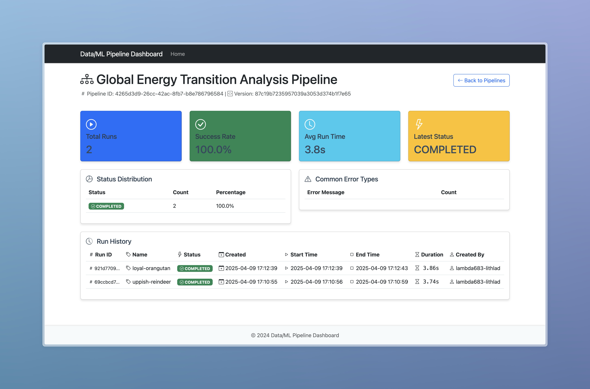
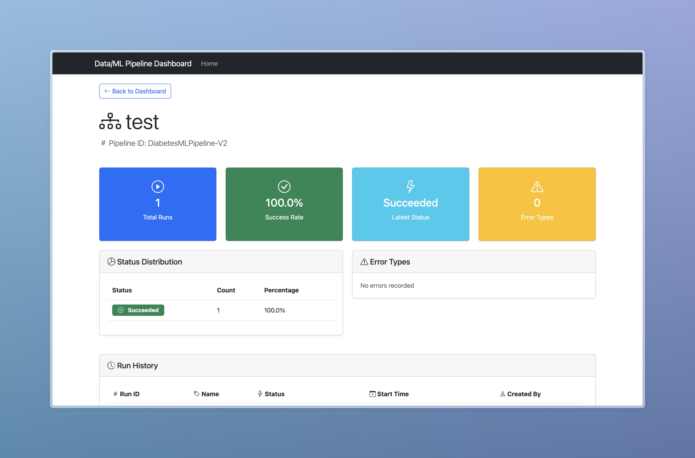

# Global Energy Transition Analysis Pipeline with Prefect

This project implements a data pipeline that analyzes global energy consumption and renewable energy adoption data from the World Bank. The pipeline tracks energy transition progress across countries and regions, providing insights into the shift towards sustainable energy sources.

## Features

- Real-time data fetching from World Bank API
- Multi-indicator energy analysis
- Regional trend analysis
- Automated report generation
- Prefect workflow management
- Automatically saves outputs as GitHub Actions artifacts
- Flask-based monitoring dashboard for pipeline status
- Custom REST APIs for pipeline monitoring
- ML pipeline Implementation via SageMaker
- SageMaker pipeline monitoring and analytics

## Dashboard App

The project includes a Flask-based dashboard application that provides real-time monitoring of both data and ML pipelines. The dashboard offers:

1. **Pipeline Overview**:
   - List of all available data and ML pipelines
   - Quick status indicators
   - Creation and last update timestamps
   - Pipeline tags and labels

2. **Pipeline Details**:
   - Comprehensive run history
   - Success rate statistics
   - Average run time metrics
   - Error analysis and common failure patterns
   - Detailed status distribution

3. **Visual Features**:
   - Modern, responsive UI
   - Interactive cards with hover effects
   - Color-coded status indicators
   - Real-time status updates
   - Detailed run history table

### Dashboard Screenshots

#### Homepage


#### Data Pipeline Details


#### ML Pipeline Details


### Running the Dashboard

1. Navigate to the dashboard directory:
```bash
cd dashboard
```

2. Install dashboard dependencies:
```bash
pip install -r requirements.txt
```

3. Start the Flask application:
```bash
python app.py
```

4. Access the dashboard at http://localhost:5000

## Custom APIs

The project includes custom REST APIs built with AWS Lambda to interact with the Prefect Cloud pipelines and SageMaker ML pipelines. These APIs provide real-time access to pipeline information and status.

### API Documentation

The complete API documentation is available at:
[SwaggerHub Documentation](https://varsni.portal.swaggerhub.com/data-pipeline-docs/default/data-pipeline-api-v-1-0-0#/default/get_data_pipelines_status)

### Available Endpoints

1. **Get All Data Pipelines**
   ```
   GET https://es3ozkq7i8.execute-api.us-east-1.amazonaws.com/dev/data/pipelines
   ```
   - Returns a list of all data pipelines running in Prefect Cloud
   - Response: List of pipeline objects with metadata

2. **Get Data Pipeline Status**
   ```
   GET https://es3ozkq7i8.execute-api.us-east-1.amazonaws.com/dev/data/pipelines/status?id={pipeline_id}
   ```
   - Returns detailed status information for a specific data pipeline
   - Parameters:
     - `id`: The unique identifier of the pipeline
   - Response: Detailed pipeline status including run history and metrics

3. **Get All ML Pipelines**
   ```
   GET https://es3ozkq7i8.execute-api.us-east-1.amazonaws.com/dev/ml/pipeline
   ```
   - Returns a list of all ML pipelines running in SageMaker
   - Response: List of ML pipeline objects with metadata

4. **Get ML Pipeline Status**
   ```
   GET https://es3ozkq7i8.execute-api.us-east-1.amazonaws.com/dev/ml/pipeline/status?pipeline_id={pipeline_id}
   ```
   - Returns detailed status information for a specific ML pipeline
   - Parameters:
     - `pipeline_id`: The unique identifier of the ML pipeline
   - Response: Detailed ML pipeline execution history and metrics

### API Usage Example

```python
import requests

# Get all data pipelines
response = requests.get('https://es3ozkq7i8.execute-api.us-east-1.amazonaws.com/dev/data/pipelines')
data_pipelines = response.json()

# Get status of a specific data pipeline
pipeline_id = "your-pipeline-id"
response = requests.get(f'https://es3ozkq7i8.execute-api.us-east-1.amazonaws.com/dev/data/pipelines/status?id={pipeline_id}')
status = response.json()

# Get all ML pipelines
response = requests.get('https://es3ozkq7i8.execute-api.us-east-1.amazonaws.com/dev/ml/pipeline')
ml_pipelines = response.json()

# Get status of a specific ML pipeline
ml_pipeline_id = "your-ml-pipeline-id"
response = requests.get(f'https://es3ozkq7i8.execute-api.us-east-1.amazonaws.com/dev/ml/pipeline/status?pipeline_id={ml_pipeline_id}')
ml_status = response.json()
```

### API Response Format

The APIs return JSON responses with the following structure:

1. **Data Pipelines List Response**:
```json
[
  {
    "id": "pipeline-id",
    "name": "Pipeline Name",
    "created": "timestamp",
    "updated": "timestamp",
    "tags": [],
    "labels": {}
  }
]
```

2. **Data Pipeline Status Response**:
```json
[
  {
    "id": "run-id",
    "name": "Run Name",
    "state_type": "COMPLETED|FAILED|CRASHED",
    "created": "timestamp",
    "start_time": "timestamp",
    "end_time": "timestamp",
    "total_run_time": 123.45,
    "state": {
      "message": "Status message",
      "timestamp": "timestamp"
    }
  }
]
```

3. **ML Pipelines List Response**:
```json
[
  {
    "PipelineArn": "arn:aws:sagemaker:region:account:pipeline/pipeline-name",
    "PipelineName": "pipeline-name",
    "PipelineDisplayName": "Pipeline Display Name",
    "CreationTime": "timestamp",
    "LastModifiedTime": "timestamp",
    "LastExecutionTime": "timestamp"
  }
]
```

4. **ML Pipeline Status Response**:
```json
{
  "PipelineExecutionSummaries": [
    {
      "PipelineExecutionArn": "arn:aws:sagemaker:region:account:pipeline/pipeline-name/execution/execution-id",
      "StartTime": "timestamp",
      "PipelineExecutionStatus": "Succeeded|Failed|Executing",
      "PipelineExecutionDisplayName": "Execution Name",
      "PipelineExecutionDetails": {
        "PipelineArn": "arn:aws:sagemaker:region:account:pipeline/pipeline-name",
        "PipelineExecutionStatus": "Succeeded|Failed|Executing",
        "CreationTime": "timestamp",
        "LastModifiedTime": "timestamp",
        "CreatedBy": {
          "UserProfileName": "user-name"
        }
      }
    }
  ]
}
```

## Output Artifacts

The pipeline generates three main artifacts that are saved in the `output` directory and uploaded as GitHub Actions artifacts:

1. **Interactive Visualizations**:
   - `energy_transition.html`: A scatter plot showing the relationship between fossil fuel and renewable energy consumption across countries
   - `regional_trends.html`: A line chart showing renewable energy adoption trends by region

2. **Analysis Report**:
   - `energy_report.txt`: A comprehensive report containing:
     - Total number of countries analyzed
     - Global average renewable energy share
     - Top 5 countries by renewable energy share
     - Top 5 countries by energy transition score
     - Links to generated visualizations

## Accessing the Artifacts

After the pipeline runs, you can access the artifacts in two ways:

1. **Through GitHub Actions**:
   - Go to the "Actions" tab in your repository
   - Select the latest workflow run
   - Scroll down to the "Artifacts" section
   - Click on "energy-analysis-output" to download the files
   - The artifacts are retained for 7 days

2. **Locally**:
   - The files are also saved in the `output` directory of your repository
   - You can find them at:
     - `output/energy_transition.html`
     - `output/regional_trends.html`
     - `output/energy_report.txt`

## Setup

1. Create a virtual environment (recommended):
```bash
python -m venv venv
source venv/bin/activate  # On Windows, use: venv\Scripts\activate
```

2. Install dependencies:
```bash
pip install -r requirements.txt
```

## Local Usage

Run the pipeline locally:
```bash
python pipeline.py
```

The pipeline will:
1. Fetch the latest energy consumption data from World Bank
2. Process and analyze energy transition metrics
3. Generate interactive visualizations
4. Create a web dashboard
5. Generate a summary report

Outputs:
- Interactive visualizations in the `output` directory
- Summary report in `output/energy_report.txt`
- Web dashboard available at http://localhost:8050

## Cloud Deployment

### Prefect Cloud Setup

1. Sign up for a Prefect Cloud account at https://app.prefect.cloud
2. Create a new workspace
3. Get your API key from the Prefect Cloud UI
4. Set up the API key in GitHub Secrets:
   - Go to your GitHub repository settings
   - Navigate to Secrets and Variables > Actions
   - Add a new secret named `PREFECT_API_KEY` with your Prefect Cloud API key
   - Add a new secret named `PREFECT_WORKSPACE` with your workspace name

### GitHub Actions

The pipeline is configured to run automatically:
- On push to the main branch
- On pull requests to the main branch
- Manually via workflow_dispatch

To run the pipeline manually:
1. Go to the Actions tab in your GitHub repository
2. Select "Run Prefect Pipeline"
3. Click "Run workflow"

## Project Structure

- `pipeline.py`: Main pipeline script containing the Prefect flow and tasks
- `requirements.txt`: Project dependencies
- `.github/workflows/pipeline.yml`: GitHub Actions workflow configuration
- `output/`: Directory containing generated visualizations and reports
- `dashboard/`: Flask-based monitoring dashboard
  - `app.py`: Main Flask application
  - `templates/`: HTML templates for the dashboard
  - `static/`: CSS and JavaScript files
  - `requirements.txt`: Dashboard-specific dependencies
- `lambdas/`: AWS Lambda functions for custom APIs
  - `data/`: Data pipeline API functions
  - `ml/`: ML pipeline API functions
  - `docs.json`: API documentation
- `README.md`: This file

## Data Analysis Features

1. Energy Consumption Analysis:
   - Per capita energy use
   - Electric power consumption
   - Fossil fuel dependency
   - Renewable energy adoption

2. Transition Metrics:
   - Energy transition score
   - Year-over-year renewable growth
   - Regional energy patterns
   - Country-level comparisons

3. Visualizations:
   - Interactive scatter plots for energy transition progress
   - Regional trend line charts
   - Web dashboard with multiple views

4. Reporting:
   - Key energy statistics
   - Top performing countries
   - Regional comparisons
   - Links to interactive visualizations

## ML Pipeline Implementation

The project includes a comprehensive ML pipeline for diabetes prediction, implemented using AWS SageMaker. The pipeline follows MLOps best practices and includes the following components:

### Pipeline Components

1. **Data Processing**
   - Uses the diabetes dataset from S3
   - Splits data into training and testing sets
   - Handles feature preprocessing and target variable renaming

2. **Model Training**
   - Implements a Random Forest Classifier using scikit-learn
   - Configurable hyperparameters:
     - Number of estimators
     - Minimum samples per leaf
     - Maximum tree depth
   - Saves model artifacts and feature information

3. **Model Evaluation**
   - Comprehensive evaluation metrics:
     - Accuracy
     - Precision
     - Recall
     - F1 Score
     - ROC AUC
   - Generates evaluation reports in JSON format

4. **Model Registry**
   - Automatic model registration in SageMaker Model Registry
   - Version control for model artifacts
   - Automated approval workflow
   - Model package group management

5. **Model Deployment**
   - Flexible deployment options
   - Supports both real-time inference and batch transformations
   - Configurable instance types and counts
   - Automatic endpoint naming with timestamps

### Pipeline Workflow

1. **Data Preparation**
   ```python
   # Load and preprocess data
   df = pd.read_csv("s3://s3-mlpipeline/diabetes-prediction/diabetes.csv")
   train_df, test_df = train_test_split(df, test_size=0.2, random_state=42)
   ```

2. **Training Step**
   ```python
   sklearn_estimator = SKLearn(
       entry_point='train.py',
       instance_type='ml.m5.xlarge',
       framework_version='0.23-1',
       hyperparameters={
           'n_estimators': 10,
           'min_samples_leaf': 2,
           'max_depth': 5
       }
   )
   ```

3. **Evaluation Step**
   ```python
   evaluation_step = ProcessingStep(
       name="ModelEvaluation",
       processor=sklearn_processor,
       inputs=[...],
       outputs=[...],
       property_files=[evaluation_report]
   )
   ```

4. **Model Registration**
   ```python
   register_model_step = RegisterModel(
       name="RegisterModelStep",
       model_package_group_name="DiabetesModelPackageGroup",
       approval_status="Approved"
   )
   ```

### Deployment

The pipeline includes a separate deployment function that can be used to deploy the latest approved model:

```python
def deploy_latest_approved_model(
    model_package_group_name="DiabetesModelPackageGroup",
    endpoint_name=None,
    instance_type="ml.m5.large",
    initial_instance_count=1
):
    # Deploy the latest approved model
    # Returns the endpoint name
```

### Usage

1. **Start the Pipeline**
   ```python
   execution = pipeline.start()
   execution.wait()
   ```

2. **Deploy the Model**
   ```python
   endpoint_name = deploy_latest_approved_model()
   print(f"Model deployed to endpoint: {endpoint_name}")
   ```

3. **Make Predictions**
   ```python
   predictor = sagemaker.predictor.Predictor(endpoint_name)
   predictions = predictor.predict(sample_input)
   ```

### Features

- **Automated Workflow**: End-to-end pipeline from data preparation to deployment
- **Model Versioning**: Automatic version control in Model Registry
- **Quality Gates**: Evaluation metrics and automated approval process
- **Scalable Deployment**: Configurable instance types and counts
- **Monitoring**: Integration with SageMaker monitoring capabilities
- **Reproducibility**: Version-controlled code and artifacts