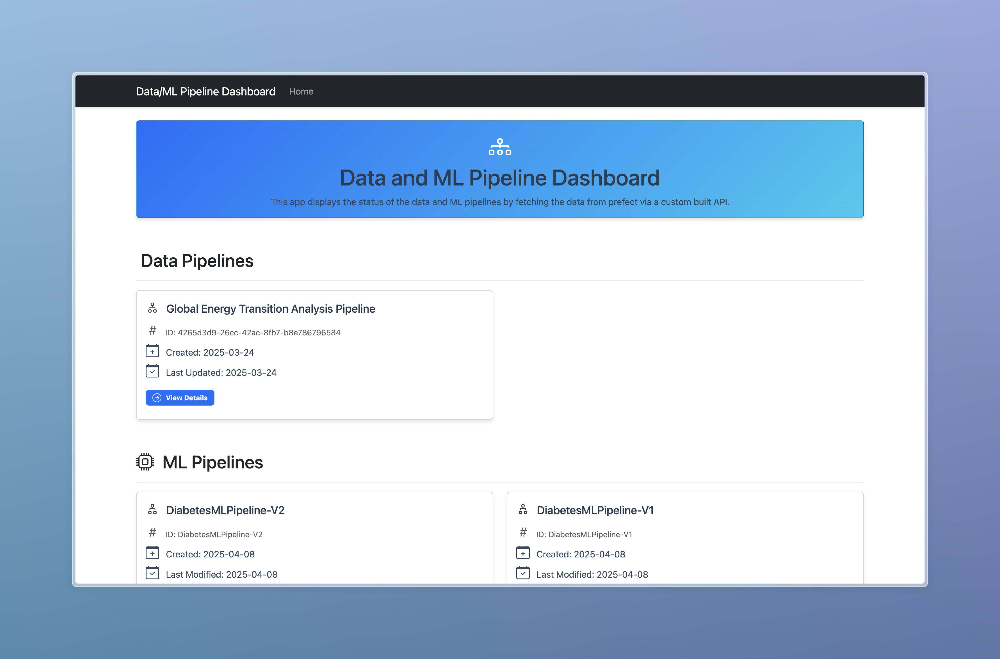
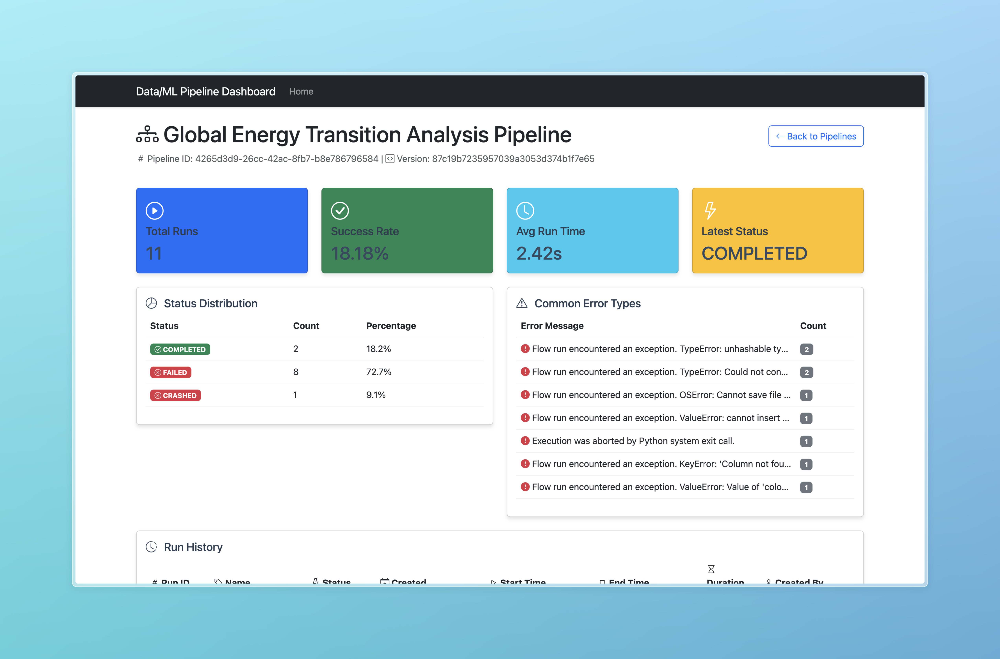
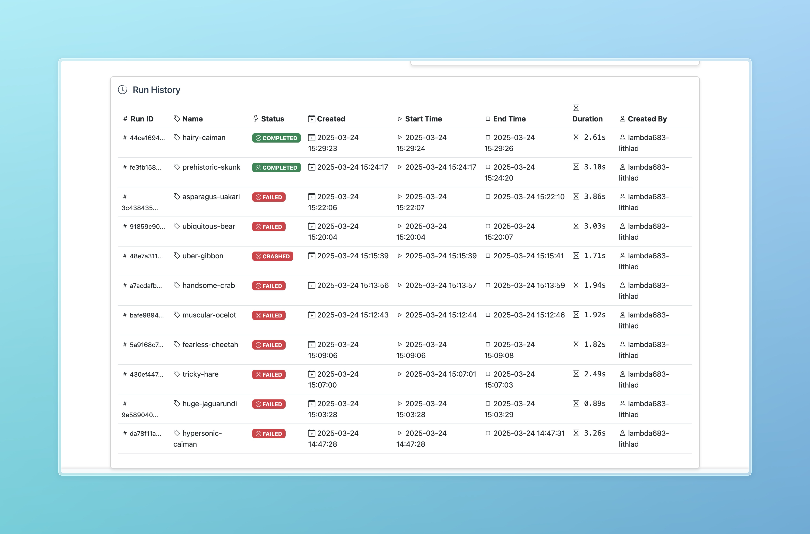

# Global Energy Transition Analysis Pipeline with Prefect

This project implements a data pipeline that analyzes global energy consumption and renewable energy adoption data from the World Bank. The pipeline tracks energy transition progress across countries and regions, providing insights into the shift towards sustainable energy sources.

## Features

- Real-time data fetching from World Bank API
- Multi-indicator energy analysis
- Regional trend analysis
- Automated report generation
- Prefect workflow management
- Automatically saves outputs as GitHub Actions artifacts
- Flask-based monitoring dashboard for pipeline status
- Custom REST APIs for pipeline monitoring

## Custom APIs

The project includes custom REST APIs built with AWS Lambda to interact with the Prefect Cloud pipelines. These APIs provide real-time access to pipeline information and status.

### API Documentation

The complete API documentation is available at:
[SwaggerHub Documentation](https://varsni.portal.swaggerhub.com/data-pipeline-docs/default/data-pipeline-api-v-1-0-0#/default/get_data_pipelines_status)

### Available Endpoints

1. **Get All Pipelines**
   ```
   GET https://es3ozkq7i8.execute-api.us-east-1.amazonaws.com/dev/data/pipelines
   ```
   - Returns a list of all pipelines running in Prefect Cloud
   - Response: List of pipeline objects with metadata

2. **Get Pipeline Status**
   ```
   GET https://es3ozkq7i8.execute-api.us-east-1.amazonaws.com/dev/data/pipelines/status?id={pipeline_id}
   ```
   - Returns detailed status information for a specific pipeline
   - Parameters:
     - `id`: The unique identifier of the pipeline
   - Response: Detailed pipeline status including run history and metrics

### API Usage Example

```python
import requests

# Get all pipelines
response = requests.get('https://es3ozkq7i8.execute-api.us-east-1.amazonaws.com/dev/data/pipelines')
pipelines = response.json()

# Get status of a specific pipeline
pipeline_id = "your-pipeline-id"
response = requests.get(f'https://es3ozkq7i8.execute-api.us-east-1.amazonaws.com/dev/data/pipelines/status?id={pipeline_id}')
status = response.json()
```

### API Response Format

The APIs return JSON responses with the following structure:

1. **Pipelines List Response**:
```json
[
  {
    "id": "pipeline-id",
    "name": "Pipeline Name",
    "created": "timestamp",
    "updated": "timestamp",
    "tags": [],
    "labels": {}
  }
]
```

2. **Pipeline Status Response**:
```json
[
  {
    "id": "run-id",
    "name": "Run Name",
    "state_type": "COMPLETED|FAILED|CRASHED",
    "created": "timestamp",
    "start_time": "timestamp",
    "end_time": "timestamp",
    "total_run_time": 123.45,
    "state": {
      "message": "Status message",
      "timestamp": "timestamp"
    }
  }
]
```

## Dashboard App

The project includes a Flask-based dashboard application that provides real-time monitoring of pipeline runs and their status. The dashboard offers:

1. **Pipeline Overview**:
   - List of all available pipelines
   - Quick status indicators
   - Creation and last update timestamps
   - Pipeline tags and labels

2. **Pipeline Details**:
   - Comprehensive run history
   - Success rate statistics
   - Average run time metrics
   - Error analysis and common failure patterns
   - Detailed status distribution

3. **Visual Features**:
   - Modern, responsive UI
   - Interactive cards with hover effects
   - Color-coded status indicators
   - Real-time status updates
   - Detailed run history table

### Dashboard Screenshots

#### Homepage


#### Pipeline Details


#### Run History


### Running the Dashboard

1. Navigate to the dashboard directory:
```bash
cd dashboard
```

2. Install dashboard dependencies:
```bash
pip install -r requirements.txt
```

3. Start the Flask application:
```bash
python app.py
```

4. Access the dashboard at http://localhost:5000

## Output Artifacts

The pipeline generates three main artifacts that are saved in the `output` directory and uploaded as GitHub Actions artifacts:

1. **Interactive Visualizations**:
   - `energy_transition.html`: A scatter plot showing the relationship between fossil fuel and renewable energy consumption across countries
   - `regional_trends.html`: A line chart showing renewable energy adoption trends by region

2. **Analysis Report**:
   - `energy_report.txt`: A comprehensive report containing:
     - Total number of countries analyzed
     - Global average renewable energy share
     - Top 5 countries by renewable energy share
     - Top 5 countries by energy transition score
     - Links to generated visualizations

## Accessing the Artifacts

After the pipeline runs, you can access the artifacts in two ways:

1. **Through GitHub Actions**:
   - Go to the "Actions" tab in your repository
   - Select the latest workflow run
   - Scroll down to the "Artifacts" section
   - Click on "energy-analysis-output" to download the files
   - The artifacts are retained for 7 days

2. **Locally**:
   - The files are also saved in the `output` directory of your repository
   - You can find them at:
     - `output/energy_transition.html`
     - `output/regional_trends.html`
     - `output/energy_report.txt`

## Setup

1. Create a virtual environment (recommended):
```bash
python -m venv venv
source venv/bin/activate  # On Windows, use: venv\Scripts\activate
```

2. Install dependencies:
```bash
pip install -r requirements.txt
```

## Local Usage

Run the pipeline locally:
```bash
python pipeline.py
```

The pipeline will:
1. Fetch the latest energy consumption data from World Bank
2. Process and analyze energy transition metrics
3. Generate interactive visualizations
4. Create a web dashboard
5. Generate a summary report

Outputs:
- Interactive visualizations in the `output` directory
- Summary report in `output/energy_report.txt`
- Web dashboard available at http://localhost:8050

## Cloud Deployment

### Prefect Cloud Setup

1. Sign up for a Prefect Cloud account at https://app.prefect.cloud
2. Create a new workspace
3. Get your API key from the Prefect Cloud UI
4. Set up the API key in GitHub Secrets:
   - Go to your GitHub repository settings
   - Navigate to Secrets and Variables > Actions
   - Add a new secret named `PREFECT_API_KEY` with your Prefect Cloud API key
   - Add a new secret named `PREFECT_WORKSPACE` with your workspace name

### GitHub Actions

The pipeline is configured to run automatically:
- On push to the main branch
- On pull requests to the main branch
- Manually via workflow_dispatch

To run the pipeline manually:
1. Go to the Actions tab in your GitHub repository
2. Select "Run Prefect Pipeline"
3. Click "Run workflow"

## Project Structure

- `pipeline.py`: Main pipeline script containing the Prefect flow and tasks
- `requirements.txt`: Project dependencies
- `.github/workflows/pipeline.yml`: GitHub Actions workflow configuration
- `output/`: Directory containing generated visualizations and reports
- `dashboard/`: Flask-based monitoring dashboard
  - `app.py`: Main Flask application
  - `templates/`: HTML templates for the dashboard
  - `static/`: CSS and JavaScript files
  - `requirements.txt`: Dashboard-specific dependencies
- `README.md`: This file

## Data Analysis Features

1. Energy Consumption Analysis:
   - Per capita energy use
   - Electric power consumption
   - Fossil fuel dependency
   - Renewable energy adoption

2. Transition Metrics:
   - Energy transition score
   - Year-over-year renewable growth
   - Regional energy patterns
   - Country-level comparisons

3. Visualizations:
   - Interactive scatter plots for energy transition progress
   - Regional trend line charts
   - Web dashboard with multiple views

4. Reporting:
   - Key energy statistics
   - Top performing countries
   - Regional comparisons
   - Links to interactive visualizations